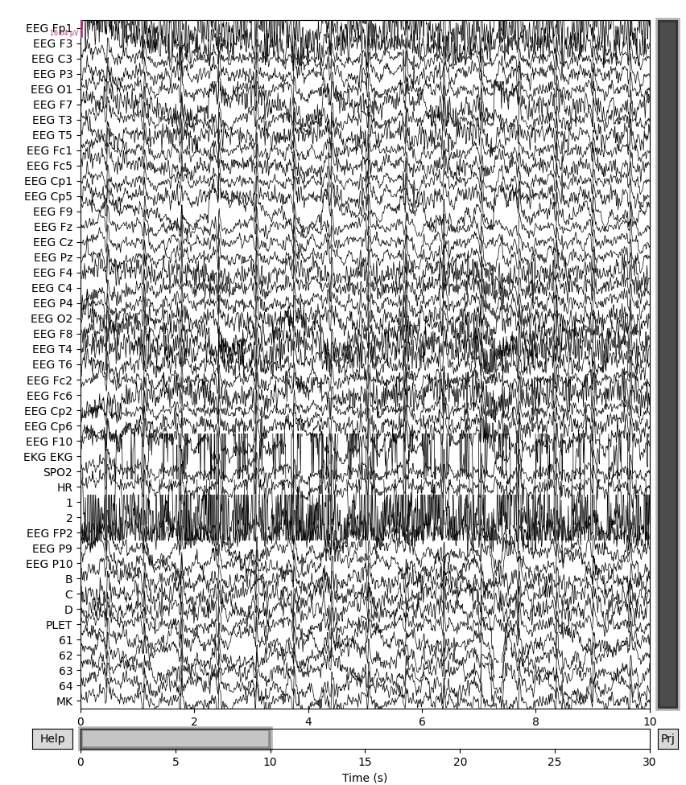
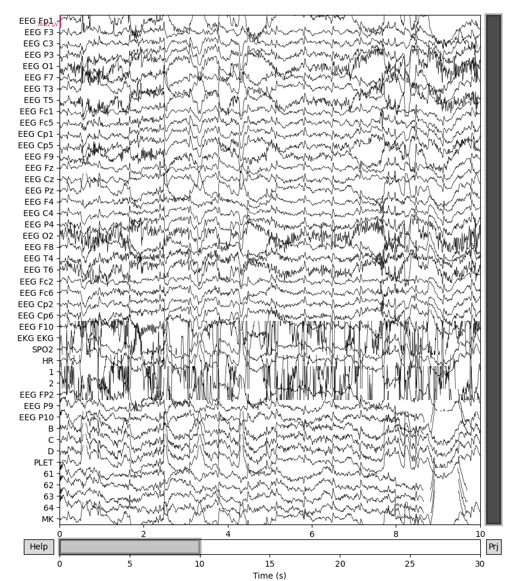

# 🧠 Preictal Seizure Detection — Siena Scalp EEG

A complete end-to-end EEG signal processing and machine learning pipeline for preictal seizure detection, applied to the [Siena Scalp EEG Dataset](https://physionet.org/content/siena-scalp-eeg/1.0.0/) (PhysioNet).

---

## 📌 Project Overview

Epileptic seizure prediction from scalp EEG is a clinically significant problem — early warning of seizure onset could enable timely intervention for the ~30% of epilepsy patients who are drug-resistant. This project investigates whether the **preictal state** (the 30 seconds immediately before seizure onset) can be distinguished from the **interictal baseline** using frequency-domain and complexity-based EEG features.

The pipeline covers every stage from raw `.edf` signal loading through to validated machine learning classification, with a focus on **methodological rigour**: Leave-One-Subject-Out cross-validation, SMOTE for class imbalance, and an explicit data scarcity analysis.

---

## 📑 Technical Report

A full technical report documenting the complete methodology, results, and discussion is available here:

🔗 [View Technical Report (PDF)](https://drive.google.com/file/d/1ct484xs26T8DHa8BfpfZkqXFtC8YG2dj/view?usp=share_link)

The report covers signal preprocessing, feature extraction, statistical analysis, and machine learning classification.

---

## 🖼️ Raw EEG: Preictal vs Interictal

The images below show representative 30-second EEG segments from Patient PN09, illustrating the qualitative difference between preictal and interictal brain states.

### Preictal — 30s before seizure onset


> The preictal window shows notably **higher amplitude**, stronger **cross-channel correlation**, and more rhythmic, synchronised activity compared to the interictal baseline — consistent with the neural hypersynchrony that precedes seizure onset.

---

### Interictal — Baseline (resting, no seizure)


> The interictal segment shows **lower amplitude**, more **independent channel dynamics**, and higher apparent signal complexity — characteristics of a brain not in a pre-seizure transitional state.

---

## 📊 Key Results

| Evaluation | Best Model | AUC |
|---|---|---|
| Subject-Independent (LOSO-CV) | Random Forest | 0.61 ± 0.24 |
| Subject-Dependent (within-patient) | SVM (RBF) | 0.70 ± 0.29 |

**Central finding:** Cross-patient generalisation is severely limited by inter-subject variability. Subject-dependent performance is further constrained by data scarcity — the Siena dataset has a median of only 5 labelled segments per patient, and a Pearson correlation of *r* = 0.61 (*p* = 0.063) was observed between segment availability and best achievable AUC.

## 🗂️ Dataset

**Siena Scalp EEG Dataset** — publicly available on PhysioNet  
🔗 https://physionet.org/content/siena-scalp-eeg/1.0.0/

- 14 epileptic patients, continuous scalp EEG recordings
- European Data Format (.edf), sampled at 512 Hz
- Standard 10–20 electrode placement (29–32 channels per patient)
- Ground-truth seizure onset/offset annotations provided
- 12 patients yielded valid segments after preprocessing → **66 labelled segments** (33 preictal, 33 interictal)

You will need a `seizure_times.csv` file with the following columns:

```
patient_id, file_name, reg_start, seiz_start, seizure_index
```

Times in `HH:MM:SS` format.

---

## ⚙️ Pipeline

```
1_visualisation.py               → Raw EEG visualisation
2_pre-processing.py              → Notch filter, bandpass, average reference
3_feature-extraction-bandpower   → Spectral band power (delta/theta/alpha/beta)
3_feature-extraction-entropy     → Permutation entropy per channel
4_analysis-bandpower_bargraph    → Per-channel band power bar plots
4_analysis-bandpower_boxplot     → Band power boxplots + Welch t-tests
4_analysis-entropy_bargraph      → Per-channel entropy bar plots
4_analysis-entropy_ttest-boxplot → Entropy paired t-tests + boxplots
5_thresholds-entropy.py          → Rule-based entropy threshold calculation
6_detection.py                   → Rule-based preictal flagging
7_ml_classification.py           → LOSO-CV: RF, SVM, XGBoost
8_subject_dependent.py           → Subject-dependent baseline + comparison plot
9_data_sufficiency.py            → Data scarcity analysis + visualisation
```

---

## 🛠️ Installation

```bash
# Clone the repo
git clone https://github.com/yourusername/siena-eeg-preictal.git
cd siena-eeg-preictal

# Create and activate virtual environment
python -m venv .venv
source .venv/bin/activate        # macOS/Linux
# .venv\Scripts\activate         # Windows

# Install dependencies
pip install mne pandas numpy scipy matplotlib \
            antropy imbalanced-learn xgboost scikit-learn
```

---

## 🚀 Usage

Run scripts in order. All scripts use paths relative to their own location.

```bash
python 1_visualisation.py
python 2_pre-processing.py
python 3_feature-extraction-bandpowervalues.py
python 3_feature-extraction-entropy_values.py
python 4_analysis-bandpower_bargraph.py
python 4_analysis-bandpower_boxplot.py
python 4_analysis-entropy_bargraph.py
python 4_analysis-entropy_ttest-boxplot.py
python 5-thresholds-entropy.py
python 6-detection.py
python 7_ml_classification.py
python 8_subject_dependent.py
python 9_data_sufficiency.py
```

Outputs saved to:
- `analysis/` — band power CSVs, entropy CSVs, segment plots
- `ml_results/` — classification summaries, per-fold results, all figures

---

## 🔬 Methods Summary

| Step | Detail |
|---|---|
| **Preprocessing** | Notch filter (50 Hz), bandpass (0.5–40 Hz), average reference |
| **Preictal window** | 30s immediately before seizure onset |
| **Interictal window** | 30s starting 150s before seizure onset |
| **Band power** | Welch PSD, trapezoidal integration over δ/θ/α/β |
| **Permutation entropy** | Order *m*=3, delay τ=1, normalised to [0,1] |
| **Feature vector** | 95 dimensions (19ch × 4 bands + 19ch entropy) |
| **Class imbalance** | SMOTE applied to training folds only |
| **CV strategy** | Leave-One-Subject-Out (subject-independent) |
| **Within-patient** | Stratified 80/20 split, 5 repeats |
| **Classifiers** | Random Forest, SVM (RBF), XGBoost |
| **Metrics** | AUC, Accuracy, Sensitivity, Specificity, F1 |

---

## 💡 Why LOSO-CV?

With only 12 patients, random k-fold cross-validation would allow train and test data from the same patient to appear in both splits — artificially inflating performance metrics. LOSO-CV ensures the model is always tested on a completely unseen patient, which is the only scientifically valid evaluation for this problem size and reflects real-world clinical deployment.
